### Michael Jahn, PhD

- 🔭 Postdoctoral Researcher at **Max Planck Unit for the Science of Pathogens**
- 🏠 Situated in **Berlin**, Germany
- 🌱 Interested in **microbial physiology**, **computational biology**, **Omics studies**
- 📝 Most recent **publication**: [Energy metabolism of hydrogen oxidizing bacterium _C.necator_](https://journals.asm.org/doi/10.1128/aem.00748-24)
- 📫 **Contact me**: jahn@mpusp.mpg.de

<table align="center">
<tr border="none">
<td width="57%" align="left">  
  
</td>
<td width="43%" align="left">
  
</td>
</tr>
</table>

